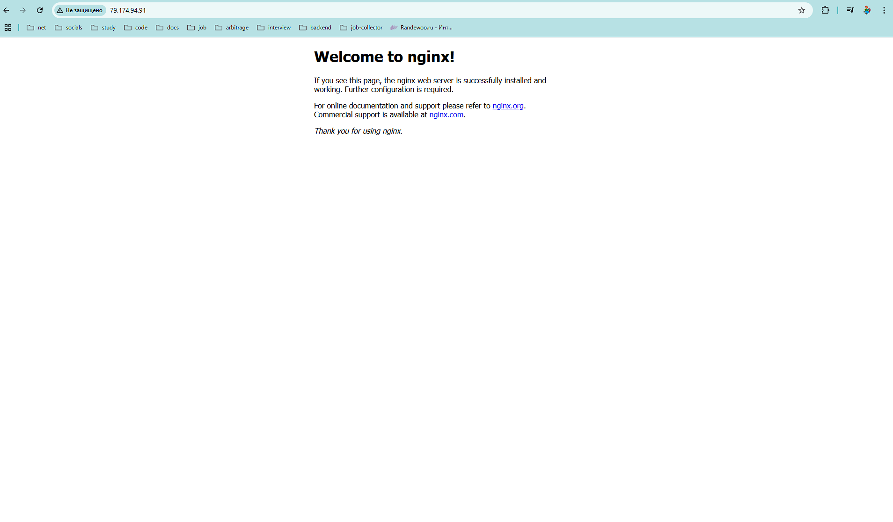
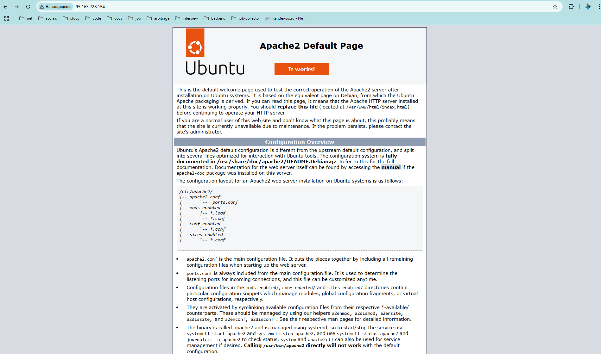

# Настройка Nginx и Apache с помощью Ansible

### [Docketfile](./ansible/Dockerfile)

Docker использовался с целью создания окружения для исполнения Ansible.

### [Исходники](./ansible/src)

### Результат исполнения playbooks/nginx.yml и playbooks/apache.yml
```
sf-ansible-ansible-1  | 
sf-ansible-ansible-1  | PLAY [nginx] *******************************************************************
sf-ansible-ansible-1  | 
sf-ansible-ansible-1  | TASK [Gathering Facts] *********************************************************
sf-ansible-ansible-1  | [WARNING]: Platform linux on host server1 is using the discovered Python
sf-ansible-ansible-1  | interpreter at /usr/bin/python3.12, but future installation of another Python
sf-ansible-ansible-1  | interpreter could change the meaning of that path. See
sf-ansible-ansible-1  | https://docs.ansible.com/ansible-
sf-ansible-ansible-1  | core/2.17/reference_appendices/interpreter_discovery.html for more information.
sf-ansible-ansible-1  | ok: [server1]
sf-ansible-ansible-1  | 
sf-ansible-ansible-1  | TASK [../roles/nginx : Install Nginx] ******************************************
sf-ansible-ansible-1  | ok: [server1]
sf-ansible-ansible-1  | 
sf-ansible-ansible-1  | TASK [../roles/nginx : Replace nginx.conf] *************************************
sf-ansible-ansible-1  | ok: [server1]
sf-ansible-ansible-1  |
sf-ansible-ansible-1  | PLAY RECAP *********************************************************************
sf-ansible-ansible-1  | server1                    : ok=3    changed=0    unreachable=0    failed=0    skipped=0    rescued=0    ignored=0
sf-ansible-ansible-1  |
sf-ansible-ansible-1  |
sf-ansible-ansible-1  | PLAY [apache] ******************************************************************
sf-ansible-ansible-1  |
sf-ansible-ansible-1  | TASK [Gathering Facts] *********************************************************
sf-ansible-ansible-1  | [WARNING]: Platform linux on host sevrer1 is using the discovered Python
sf-ansible-ansible-1  | interpreter at /usr/bin/python3.12, but future installation of another Python
sf-ansible-ansible-1  | interpreter could change the meaning of that path. See
sf-ansible-ansible-1  | https://docs.ansible.com/ansible-
sf-ansible-ansible-1  | core/2.17/reference_appendices/interpreter_discovery.html for more information.
sf-ansible-ansible-1  | ok: [sevrer1]
sf-ansible-ansible-1  |
sf-ansible-ansible-1  | TASK [../roles/apache : Install Apache] ****************************************
sf-ansible-ansible-1  | ok: [sevrer1]
sf-ansible-ansible-1  |
sf-ansible-ansible-1  | TASK [../roles/apache : Create document root] **********************************
sf-ansible-ansible-1  | changed: [sevrer1]
sf-ansible-ansible-1  |
sf-ansible-ansible-1  | PLAY RECAP *********************************************************************
sf-ansible-ansible-1  | sevrer1                    : ok=3    changed=1    unreachable=0    failed=0    skipped=0    rescued=0    ignored=0
sf-ansible-ansible-1  |
sf-ansible-ansible-1 exited with code 0
```

### Работоспособность Nginx


### Работоспособность Apache


